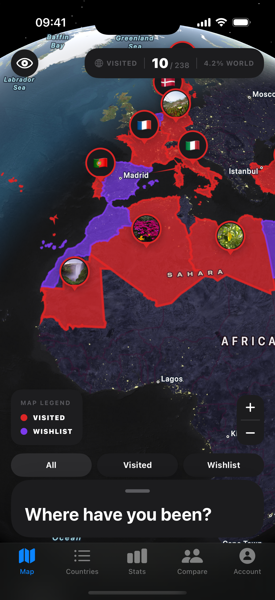

# Wandova

**Track the world you've seen.** Wandova is an iOS app for logging the countries you've visited and the ones still on your list — an interactive world map, personal notes and photos per country, travel stats and achievements, and automatic cross-device sync that works offline-first.

  

## Highlights

- **Interactive map** — visited and want-to-visit countries painted on a MapKit world map
- **Memories** — photos and notes attached to each country
- **Stats & achievements** — continents covered, world percentage, unlockable milestones
- **Compare** — match your travel map against a friend's
- **Offline-first sync** — every change lands on-device instantly and reconciles with the cloud when connectivity allows

## Stack

SwiftUI · SwiftData · Firestore · Combine · XCTest

MVVM with a repository layer; a pure conflict resolver handles cross-device sync (last-write-wins records, union-merged photos) and is covered by unit tests. The full design — including its known trade-offs — is in **[docs/ARCHITECTURE.md](docs/ARCHITECTURE.md)**.

## Try it

📲 TestFlight / App Store link coming soon.

Build from source

1. Clone the repo and create a [Firebase](https://firebase.google.com) project with Authentication (Email, Google, Apple) and Firestore enabled.
2. Add an iOS app with bundle ID `com.selineren.Wandova`, download `GoogleService-Info.plist`, and place it at `WandovaIOS/Wandova/GoogleService-Info.plist` (it's gitignored).
3. `open WandovaIOS/Wandova.xcodeproj` and run on iOS 17.6+ with Xcode 16+. Tests: `Cmd+U`.

---

Built by [Selin Eren](https://github.com/selineren) · SwiftUI · iOS 17.6+
